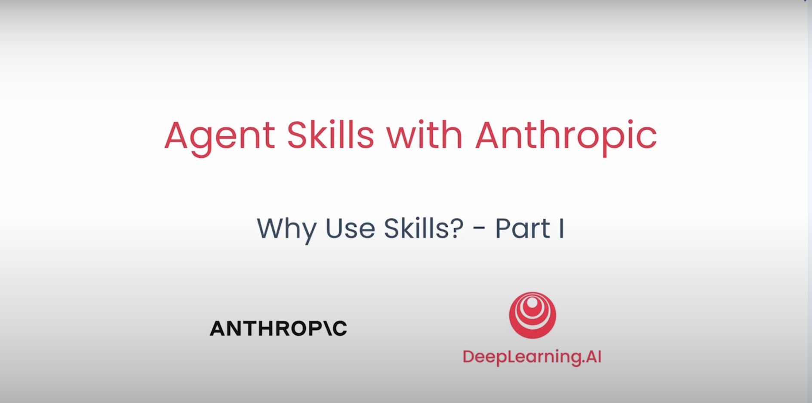
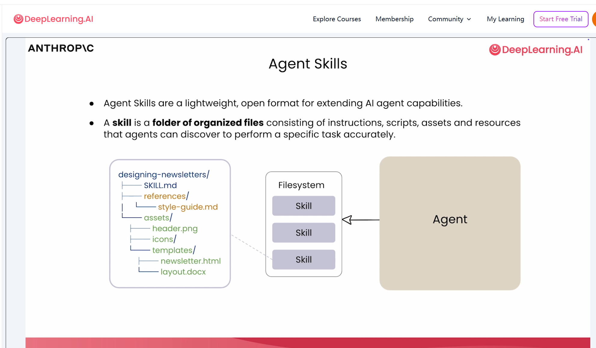
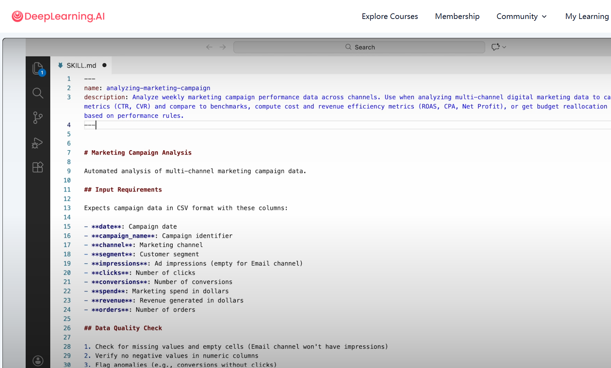
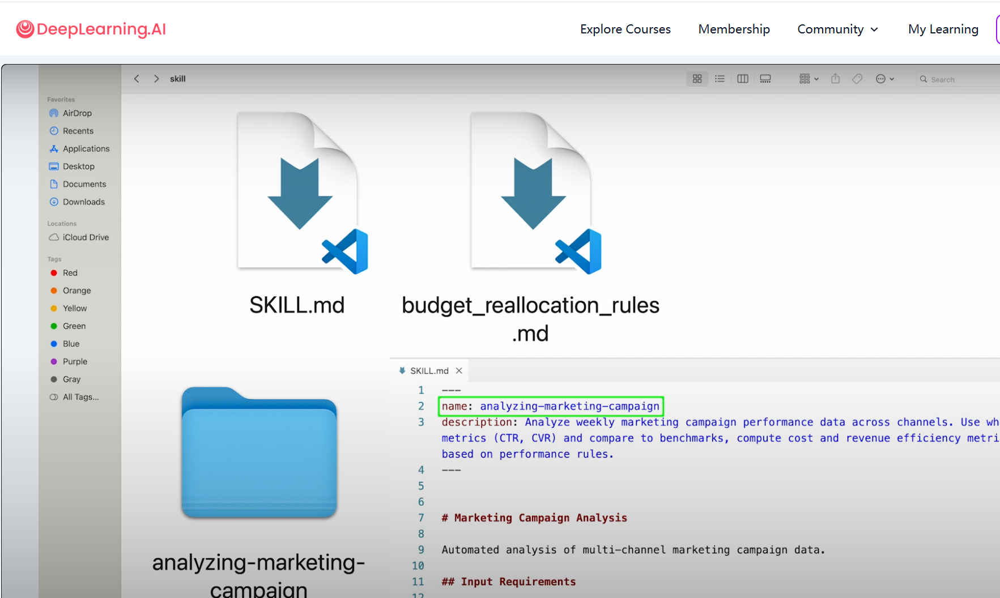
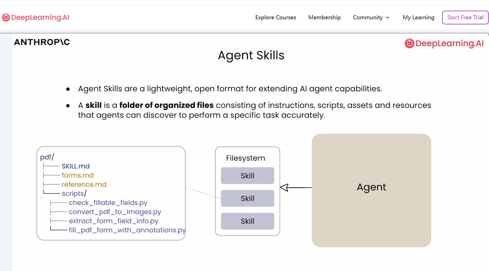

# 2.Why Use Skills 1（Skills的意义）

# Why Use Skills - Skills的意义



# 1 WHAT | SKILL 是什么



- 一种轻量、开放的格式，用于扩展 AI agent 能力 | A lightweight, open format for extending AI agent capabilities
- 一个组织好的文件夹，由以下部分组成 | A folder of organized files consisting of:
    1. 指令 | Instructions
    2. 脚本 | Scripts
    3. 资产与资源 | Assets and resources

# 2 WHERE | 用武之地——在哪里用？

## 2.1 大观——Skills的用武之地

- 领域专业知识 | Domain Expertise
- 可重复的工作流程 | Repeatable Workflow
- 新能力 | New Capabilities

## 2.2 Use Cases | 使用场景

- 领域专业知识 | Domain Expertise
    - 品牌规范与模板 | Brand guidelines and templates
    - 法务审核流程 | Legal review processes
    - 数据分析方法论 | Data analysis methodologies
- 可重复的工作流程 | Repeatable Workflow
    - 每周营销活动复盘 | Weekly marketing campaign review
    - 客户电话准备流程 | Customer call prep workflow
    - 季度业务复盘 | Quarterly business review
- 新能力 | New Capabilities
    - 制作演示文稿 | Creating presentations
    - 生成 Excel 表或 PDF 报告 | Generating Excel sheets or PDF reports
    - 搭建 MCP 服务器 | Building MCP servers

## 2.3 Without Skills | 没有 Skills 会怎样

- 每次都要重新描述指令与需求 | Describe your instructions and requirements every time
- 每次都要重新打包参考资料与支持文件 | Bundle all your references and supporting files every time
- 难以保证流程或产出始终一致 | Ensure the workflow or outputs are always consistent

# 3 HOW | 理论大观

## 3.1 Progressive Disclosure | 渐进式披露——YAML+md+元数据| 指令|资源

- YAML 前置元数据 | YAML Frontmatter
    - 名称 | name
    - 描述 | description
- Markdown 正文 | Markdown
    - 输入 | Input
    - 漏斗指标（按渠道）| Funnel Metrics (per channel)
    - 效率指标（按渠道）| Efficiency Metrics (per channel)
    - 输出表格 | Output Tables
    - 预算重新分配 | Budget Reallocation
- 元数据：总是加载 | Metadata: always loaded
- 指令：触发时加载 | Instructions: loaded when triggered
- 资源：按需加载 | Resources: loaded as needed

# 4 Excel Skills 的实践分析

Skills 是 AI Agent 系统实现复杂自动化与专业化任务的核心单元。

结合实际案例，我们来看如何搭建和实现 Excel 相关的 Skills。

## 4.1 目录结构示例


以”分析营销活动”为例，Skill 目录结构如下：

```
analyzing-marketing-campaign/
├── SKILL.md
└── references/
    └── budget_relocation_rules.md

```

- `SKILL.md`：主说明文档，描述 Skill 用途、输入输出、核心流程
- `references/`：存放参考规则、模板、辅助文档等
    
    
    

## 4.2 SKILL.md 内容与 YAML元数据



SKILL.md 通常包含 YAML Frontmatter（元数据区块），以及详细的任务描述、输入输出格式、核心指标和操作流程。例如：

```markdown
---
name: analyzing-marketing-campaign
description: 分析多渠道数字营销数据，计算转化漏斗、效率指标，并给出预算调整建议。
inputs:
  - file: Excel/CSV，包含Date, Campaign_Name, Channel, Impressions, Clicks, Conversions, Spend, Revenue, Orders等字段
outputs:
  - Markdown/Excel表格，含各项指标与建议
---

## 任务流程
1.读取Excel/CSV数据。
2.计算各渠道CTR（点击率）、CVR（转化率）。
3.计算ROAS（广告回报率）、CPA（获客成本）、净利润等效率指标。
4.输出对比表格，生成分析解读与预算建议。

## 公式示例
-CTR% = Clicks / Impressions * 100
-CVR% = Conversions / Clicks * 100
-ROAS = Revenue / Spend
-CPA = Spend / Conversions
-Net Profit = Revenue - (Spend + 其它成本)
```

## 4.3 Excel Skills 的实现与案例

### 4.3.1 常见 Excel 自动化任务

- 数据汇总与统计（如销售总额、最大单笔交易）
- 条件格式化（如根据状态标记行颜色）
- 多表合并（如客户与订单表按 ID 合并）
- 批量文件生成（如根据模板自动生成邀请函、产品文档）
- 数据过滤、排序与导出

### 4.3.2 Excel Skill 实现的技术路线

### 工具选择

- **pandas**：适合批量数据处理、分析、导出
- **openpyxl**：适合复杂格式、公式、Excel 特性操作

### 工作流程

1. **选择工具**：根据需求选择 pandas 或 openpyxl
2. **创建/加载文件**：新建或读取工作簿
3. **数据处理**：增删改查、公式、格式化
4. **保存文件**：写回 Excel
5. **公式重算**：如涉及公式，需用 recalc.py 脚本进行重算（openpyxl 仅写入公式字符串，不计算结果）
6. **错误校验与修复**：Skill 应返回 JSON 报告所有错误类型和位置，便于二次修正

### 4.3.3 Skill 文件夹完整结构

```
excel-skill/
├── SKILL.md
├── scripts/
│   ├── process_data.py
│   ├── recalc.py
├── references/
│   ├── example_input.xlsx
│   ├── output_template.xlsx
│   └── rules.md

```



- `scripts/`：存放数据处理、公式重算等 Python 脚本
- `references`：输入样例、输出模板、规则文档
- `SKILL.md`：说明 Skill 用途、输入输出、流程与注意事项

### 4.3.4 实践建议与最佳实践

- 明确 Skill 的输入输出标准，示例文件放在 references 目录
- 所有脚本应有异常处理与错误报告能力，便于 Agent 自动修复
- 复杂逻辑建议分模块实现，主流程在 SKILL.md 中清晰描述
- Excel 公式相关操作建议分离脚本处理，避免直接在 openpyxl 中计算
- 尽量输出中间结果与最终数据，便于人工或 Agent 二次校验

# 5 总结

Skills 为 AI Agent 提供了专业化、标准化、可复用的能力扩展载体，极大提升了自动化办公与复杂数据处理的效率。

Excel Skill 作为典型案例，通过 SKILL.md 元数据、脚本与参考文件的组合，实现了从数据读取、处理、输出到结果校验的自动化全流程。未来，随着 Skill 生态丰富，AI Agent 将能像积木一样组合各种能力，满足更多元的业务需求。