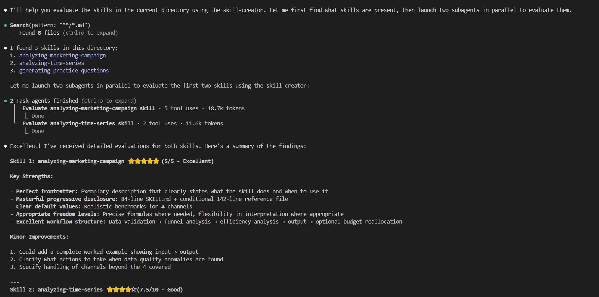

# 第六节：Creating Custom Skills（自定义 Skills）


---
本节将深入剖析 Skills 的组成结构，并手把手演示如何从零构建高质量 Skills。随后，我们将通过两个实战示例——“基于讲义自动生成练习题”与“时间序列数据特征分析”——将所学知识付诸实践。

回顾一下，我们创建的每个 Skills 都有一个必需的 SKILL.md 文件，其中包含需要 name 和 description 的 YAML 前置元数据。在底层的 SKILL.md 中，我们有 Skills 的内容，以及对脚本或任何附加文本文件、必需资源的引用，这些资源只有在需要时才会加载。


## 1、Skills 的命名技巧

比如下图 analyzing-marketing-campaign/SKILL.md 文件的内容,是 SKILL 的 name 和 description。


### 1.1 Skills 的 name 命名

Skills 的 name 不仅是 Skills 的标识符，更是 AI 理解和选择 Skills 的重要依据。一个好的 Skillsname 应该清晰、准确地传达 Skills 的核心功能，让开发者和 AI 都能快速理解其用途。

Skillsname 应该采用「动词+ing」的格式，例如「generating-practice-questions」或「analyzing-time-series」。这种命名模式能够清晰地表达 Skills 的动作属性，让使用者一眼就能看出该 Skills 是做什么的。同时，这种统一的命名规范也有助于 Skills 的分类和检索，提高整个 Skills 库的可管理性。

Skills 的 name 还有一个重要的注意事项是字符数量的限制。虽然具体的上限数值可能因系统而异，但开发者在命名时应该遵循简洁的原则，避免使用过长或过于复杂的 name。一个简洁有力的 name 不仅便于记忆  和引用，还能提高 Skills 被正确识别的概率。

### 1.2 Skills 的 description 命名

Skills 的 description 是另一个关键的元数据组件，它的撰写需要遵循比 name 更加详细的规范。好的 description 不仅要说明 Skills **做什么**，还要明确说明何时使用以及「**如何使用**。这种全面的 description 能够帮助人工智能在面对复杂任务时做出正确的 Skills 选择决策。

在撰写 description 时，应该特别关注那些能够触发 Skills 使用的关键词和短语。如果存在特定的关键词或短语会引导人工智能选择该 Skills，那么这些关键词应该被明确地包含在 description 中。这种策略性的关键词布局可以显著提高 Skills 被正确触发的概率，使 Skills 发挥其设计的作用。

description 还应该包含 Skills 的输入要求、输出格式以及任何特殊的使用条件。这些信息虽然可能增加 description 的长度，但对于确保 Skills 的正确使用至关重要。一个完整的 description 应该让使用者无需阅读 Skills 的具体实现代码，就能理解如何有效地使用该 Skills。

| 必填字段 | 约束条件 |
|---------|---------|
| **name (name)** | • 最多 64 个字符<br>• 只能包含小写字母、数字和连字符<br>• 不能以连字符开头或结尾<br>• 必须与父目录 name 匹配<br>• 建议使用动名词形式（动词+-ing） |
| **description (description)** | • 最多 1024 个字符<br>• 不能为空<br>• 应 descriptionSkills 的功能以及何时使用它<br>• 应包含帮助智能体识别相关任务的具体关键词 |

 


### 1.3 Skills 的可选字段命名

Skills 规范定义了两种类型的元数据字段：必需字段和可选字段。必需字段包括 Skills 名称和描述，它们是每个 Skills 都必须具备的核心元数据。这些字段确保了 Skills 的基本可识别性和功能说明，是 Skills 能够被正确使用的基础。

可选字段则为 Skills 提供了更多的配置可能性，开发者可以根据实际需要选择添加。可选字段可以包括许可证信息、兼容性说明以及任意的键值对数据。许可证字段用于声明 Skills 的使用条款，兼容性字段可以指定 Skills 适用的平台或环境要求，而自定义键值对则允许开发者添加任何其他有用的元数据信息。

  

| 可选字段 | 约束条件 |
|---------|---------|
| **license（许可证）** | 许可证名称或对许可证文件的引用 |
| **compatibility（兼容性）** | 最多 500 个字符，指示环境要求 |
| **metadata（元数据）** | 任意键值对 |
| **allowed-tools（允许的工具）** | 预批准工具的空格分隔列表（实验性功能） |

### 1.4 正文内容要求

格式限制：没有什么格式限制，建议章节分步说明 (Step-by-step instructions)；有输入格式、输出格式或输入输出示例；保持在 500 行以内；将详细参考资料移至单独文件，显示基本内容，链接到高级或特定领域内容；引用文件与 SKILL.md 保持一级目录深度（避免嵌套引用）。


 


| 自由度等级 | 特征 |
|-----------|------|
| **高自由度** | • 基于文本的一般性指导<br>• 允许多种方法 |
| **中自由度** | • 说明包含可自定义的伪代码、代码示例或模式<br>• 存在首选模式但允许一定变化 |
| **低自由度** | • 说明引用特定脚本<br>• 必须遵循特定序列 |

复杂工作流处理（Complex Workflows）：将复杂操作分解为清晰的顺序步骤；若工作流步骤过多，考虑将其拆分到单独文件。

 


**核心要点总结**
简洁优先：正文控制在 500 行以内，避免冗长
分层组织：基础内容放正文，详细内容放引用文件
扁平引用：只使用一级文件引用，不嵌套
灵活度选择：根据任务复杂度选择高/中/低自由度
步骤化：复杂任务必须拆分为清晰的顺序步骤，每个步骤都有明确的目标和操作


### 1.5 可选目录（Optional Directories）
    

技能规范预留了可选目录的空间，允许开发者根据需要组织额外的资源和文件。这些可选目录包括**脚本（scripts）目录**、**资料（references）目录**和**资产（assets）目录**，它们为技能提供了扩展功能的灵活性。每个目录都有其特定的用途和设计原则，理解这些原则对于创建功能完善的技能至关重要。

scripts 目录包含技能需要执行的任何形式的代码。这些代码可以是任何编程语言编写的小程序或函数库，它们将在技能执行过程中被读取和执行。脚本目录的设计允许技能分离核心逻辑和辅助功能，使得技能的结构更加清晰。

references 资料目录用于存放技能可能需要的额外文档或参考文件。这些文件可以包含详细的算法说明、API 文档、格式规范或其他有助于技能执行的信息。在设计技能时，如果存在需要完整阅读才能理解的参考资料，将它们放在这个目录中是一个好的选择。

assets 目录是存放各种输出资源的地方，这些资源可以包括用于输出的模板文件、图像、徽标、数据文件、模式定义等多种类型的资产。资产目录的设计使得技能能够灵活地处理各种输出需求，而不必将所有格式定义都硬编码在主文件中。

| 目录 | 内容 | 备注 |
|------|------|------|
| /scripts | - 清晰记录依赖项<br>- 脚本有清晰的文档<br>- 错误处理明确且有帮助 | 注意：在您的说明中明确 Claude 是应执行该脚本，还是将其作为参考阅读。 |
| /references | - 包含代理在需要时可阅读的附加文档。<br>- 保持单个参考文件的专注性。 | 注意：对于超过 100 行的参考文件，在顶部包含内容目录。这确保代理能看到完整范围。 |
| /assets | - 模板：<br>  - 文档模板<br>  - 配置模板<br>- 图像：<br>  - 图表<br>  - 标志<br>- 数据文件：<br>  - 查找表<br>  - 模式 |  |

---

## 2、实践教程

### 案例 1 generating-practice-questions（练习题生成）

第一个技能是生成练习题的能力，它可以根据输入的讲义笔记生成用于测试理解程度的各类教育练习题。这个技能的设计充分体现了前面讨论的各种最佳实践，是学习技能构建的理想案例。

  

这个练习题生成技能的设计理念是让教师或讲师能够轻松地创建全面的测试题库。用户只需要提供讲义笔记的内容，技能就能自动生成多种类型的问题，包括判断题、选择题、简答题和应用题等。技能支持特定的输入和输出格式要求，确保生成的问题具有统一的结构和质量标准。

首先我们一起看 SKILL.md 文件的内容，它包含了技能的详细说明、输入输出格式要求、问题生成规则等。

  

在设计技能时，我们首先明确了支持的输入类型。这个技能主要处理文本输入，支持使用特定的文本处理库来提取和分析讲义内容。输入处理部分需要指定具体的库函数和参数，以确保能够正确地解析各种格式的讲义文档。


输出格式的设计同样需要非常具体。技能生成的问题遵循严格的结构规范，从简单的判断题开始，逐步过渡到需要深入理解的应用题。这种层次化的设计确保了问题难度的递进性，能够全面地测试学习者的理解程度。


```bash
## Input 

**Supported formats**: LaTeX (.tex), PDF, Markdown (.md), plain text (.txt)

- **PDF**: Use `pdfplumber` for text extraction

- **LaTeX**: Read as text, strip preamble (everything before `\begin{document}`), preserve math environments (`$...$`, `\[...\]`, `\begin{equation}`, etc.)

- **Markdown/Text**

**Content to extract**:

1. **Learning objectives** - Usually at beginning: "After this lecture, you should be able to..." or may be in section: "Learning Outcomes","Objectives", "Goals". If absent, derive from main topics.
2. **Main topics** - Section headings, bold terms, definitions, algorithms.
3. **Examples** - Use for realistic scenarios in questions.
```

问题结构部分，指定了确切的顺序和数量要求，包括判断题、选择题、简答题和应用题。每个问题类型都有其特定的生成规则和质量标准，确保生成的问题符合教育考试的要求。对于每一个子问题下面都有一个子指南，详细说明生成该类型问题的具体步骤和要求。


输出格式的设计同样需要非常具体。技能生成的问题遵循严格的结构规范，从简单的判断题开始，逐步过渡到需要深入理解的应用题。这种层次化的设计确保了问题难度的递进性，能够全面地测试学习者的理解程度。


在处理输出格式时，一个关键的实践是不将所有格式定义都放在 SKILL.md 主文件中。相反，技能引用 assets 文件夹中的模板文件来定义具体的输出格式。例如，如果用户请求 Markdown 格式的输出，技能会加载并使用对应的 Markdown 模板；如果需要 LaTeX 格式，则使用相应的 LaTeX 模板。

这种模板化的设计有多个优点：首先，它保持了主文件的简洁性，避免了格式定义代码膨胀；其次，它使得添加新的输出格式变得简单，只需要创建新的模板文件即可；最后，它允许用户自定义输出格式，满足特殊的需求。通过仅加载特定需要的模板，技能还能提高令牌使用效率和上下文窗口的利用率。

```bash
## Output Format Guidelines

Output format depends on user request (LaTeX, PDF, Markdown, plain text).

**General structure for all formats**:

1. Title with document name
2. Instructions section
3. Part 1: True/False Questions (numbered sequentially)
4. Part 2: Explanatory Questions (numbered sequentially)
5. Part 3: Coding Question (with steps, signature, examples, hints)
6. Part 4: Use Case Application (with scenario, data, task, requirements, hints)

**For specific formats**: For LaTeX and Markdown document structures, use the following templates (in `assets/` folder):
- `questions_template.tex` - Complete LaTeX document structure with formatting
- `markdown_template.md` - Complete Markdown document structure
```


### 案例 2 analyzing-time-series(分析时间序列)

第二个实践案例是分析时间序列数据特征的技能，它能够自动识别数据中的模式、趋势和异常。这个技能展示了如何将复杂的分析功能封装为可重用的技能单元，使人工智能能够轻松地执行专业的数据分析任务。

时间序列分析是一个广泛应用的领域，涉及金融、工业监控、医疗诊断等多个行业。通过将这一功能封装为技能，用户可以简单地提供数据文件，技能就能自动完成特征提取、模式识别和异常检测等工作，大大降低了数据分析的技术门槛。


 

它有一个非常特殊的工作流，分为三步，分别是运行诊断、生成可视化图表和报告结果，使用 scripts 文件夹中的 Python 脚本执行每个步骤。


```bash
## Workflow

**Step 1: Run diagnostics**

python scripts/diagnose.py data.csv --output-dir results/


This runs all statistical tests and analyses. Outputs `diagnostics.json` with all metrics and `summary.txt` with human-readable findings. Column names are auto-detected, or can be specified with `--date-col` and `--value-col` options.

**Step 2: Generate plots (optional)**
python scripts/visualize.py data.csv --output-dir results/


Creates diagnostic plots in `results/plots/` for visual inspection. Run after `diagnose.py` to ensure ACF/PACF plots are synchronized with stationarity results. Column names are auto-detected, or can be specified with `--date-col` and `--value-col` options.

**Step 3: Report to user**

Summarize findings from `summary.txt` and present relevant plots. See `references/interpretation.md` for guidance on:
- Is the data forecastable?
- Is it stationary? How much differencing is needed?
- Is there seasonality? What period?
- Is there a trend? What direction?
- Is a transform needed?

```

## 3、claude 上手操作

在 cluade code 增添 anthropics/skills 的技能库，首先打开 cluade code，输入'/'之后，输入'plugin'


然后选择 ‘Marketplace’，选择 ‘Add Marketplace’，输入'anthropics/skills',这是我们看到的 github 仓库。（这一步其实在 git 下载 anthropics/skills 仓库，网络不好需要多试几次，如果实在不行请科学上网！！！。）


下载之后，如下图所示则证明你安装成功：有两个文件，一个是 diagnose.py，一个是 document-skills，一个是 example-skills；


document-skills 主要包括处理 Excel、Powerpoint、word、pdf 文件；example-skills 则是示例技能。然后我们安装 example-skills 在文件目录下，如下图所示则安装成功.


然后重启 cluade code,输入/skills,就可以看到我们安装的所有 skills。

 

然后我们输入,然后如下图所示，利用 skill-creator 进行 skills 评测。
```bash
Use the skill-creator to evaluate how well ny ski11s in ./6.Creating Custom Skills（自定义 skills/ have followed the best practices. Use two subagents in parallel, each subagent evaluates one
```
 

稍等大概一分钟左右，我们会得到结果：

 

## 4、skills 评测

创建一个高质量的技能通常需要多次迭代和优化。初始阶段应该关注核心功能的实现，确保技能能够完成其基本任务。在这个阶段，不需要过多地考虑边缘情况或优化问题，重点是验证设计思路的可行性。

随着技能的逐步完善，应该开始关注细节的打磨。这包括完善错误处理逻辑、补充文档说明、优化用户体验等方面。在这个阶段，使用前面讨论的最佳实践来审视和改进技能的各项设计决策，确保整体质量达到生产级标准。

在将技能投入实际使用之前，全面的测试是必不可少的。测试应该覆盖正常流程和异常流程，验证技能在各种输入条件下都能产生正确的输出。边缘情况的处理尤其需要仔细测试，确保技能能够优雅地处理各种非标准的输入。

验证技能是否符合最佳实践可以使用自动化的评估工具。这些工具可以检查技能的元数据完整性、命名规范性、内容组织合理性等方面，提供客观的质量评估报告。根据评估结果进行针对性的改进，可以有效地提升技能的整体质量。

[返回目录](../README.md)