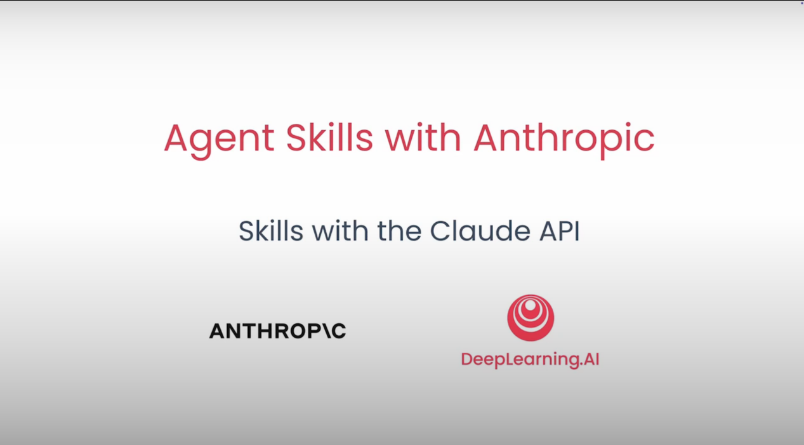
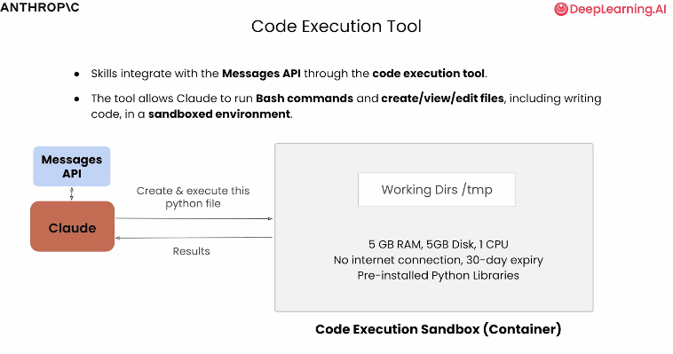
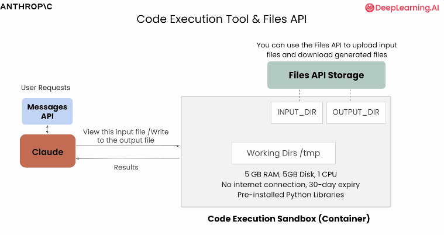
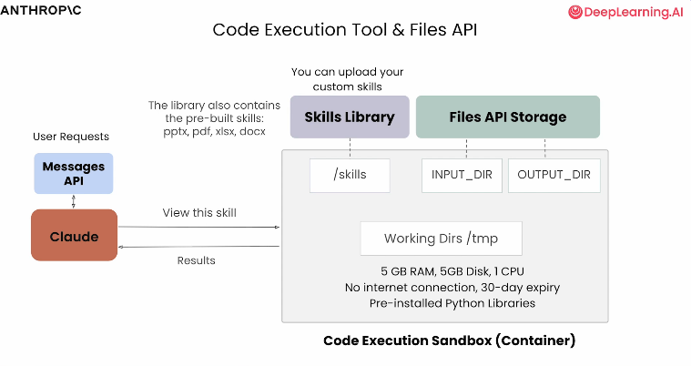

# 7.Skill with the Claude API.md

# Introduce Skills with the Claude API

### (通过 Claude API 介绍技能功能)

---

在第一课中，你已经了解了技能（Skills）在 Claude AI 中的运作方式。

现在，我们将开始使用 Claude API来测试我们在上一课中创建了两个技能。

要在 Claude API 中使用技能，我们需要用到代码执行工具和文件 API。

这将让 Claude 获得文件系统的访问权限，使其能够读写文件，并通过 bash 执行代码。

---

我们开始吧。之前我们已经聊了很多关于技能的运作原理以及创建方法。

我们也简单提到了技能在 Claude 生态系统不同环境下的可移植性，以及在其他众多智能代理类应用中的表现。

我们先从 Claude AI 和 Claude Desktop 中的技能讲起，现在我们要转向介绍如何通过 Claude Messages API 使用技能。

---

## 重要注意事项

有两点需要重点注意。

**第一**，你在 Claude AI 和 Claude Desktop 中创建的技能不会在 Claude API 或 Claude Code 中共享。

> 💭 **个人思考**：这个限制其实挺合理的，但也意味着我们需要在不同环境之间手动迁移技能。我个人的建议是：把常用的技能保存到一个git仓库里，这样在不同环境中都能快速部署。虽然有点麻烦，但至少能保证技能的一致性，还能顺便做版本控制。

**第二点重要信息**是，为了让技能正常工作，我们需要让 Claude 具备执行代码、创建和编辑文档、演示文稿、PDF以及数据报告，并且能与文件系统交互的能力。

在使用 Claude API 时，这些功能都需要我们手动配置，而在使用 Claude AI 和 Claude Desktop 时，这些功能会直接为你配置好。

在 Claude Desktop 或 Claude AI 中，如果我进入设置查看功能配置，你会看到这里有一个"代码执行与文件创建"的板块。

这正是我们后续直接使用 API 时要深入讲解的内容。

这是一个默认启用的设置，它允许 Claude 执行代码、创建文档、电子表格、演示文稿等内容。

这实际上相当于给 Claude AI 和 Claude Desktop分配了一台计算机或虚拟机，用于执行代码并完成所有让技能得以运行的任务。如果该功能被禁用，我们会发现必须先将其开启才能使用技能。

---

## 代码执行工具和文件创建功能

现在我们回到正题，来聊聊代码执行工具和文件创建功能的工作原理，因为在使用 API 时，我们需要手动启用这些功能。

当使用 Claude Code 和 Claude 智能代理这类工具时，你可以直接访问文件系统。而使用 Claude API 时则无法直接访问，我们需要一个容器来执行代码，并搭配一个文件系统来使用。

在 Claude AI 和 Claude Desktop 中，这种容器化环境和文件系统是直接提供给你的，无需你自行实现。归根结底，功能本身是完全相同的，只是我们使用技能的方式略有不同。

技能本身不会改变，技能的格式也不会改变，但根据你所处的环境不同，使用技能的具体方式可能会略有差异。

当我们开始探索 Messages API 时，我们会用到代码执行工具。代码执行工具允许 Claude 运行Bash 或 Shell 命令，来完成我们在使用技能时看到的所有操作：创建、查看、编辑文件，以及编写代码，所有这些都在一个沙箱环境中进行。

代码执行工具让我们的应用能够拥有一个独立的专属容器，用于执行代码和操作文件系统。正如你所看到的技能能实现的所有功能，这对于读取我们的技能、在技能中执行代码，以及处理我们可能想要编辑、查看和创建的其他文件来说至关重要。

为了让你更直观地理解这一点，当我们集成代码执行工具时，相当于给 Claude 提供了一个执行沙箱或容器。

当我们让 Claude 创建并执行文件时，这些操作会在一个安全且隔离的环境中进行。该环境对内存、磁盘、CPU 等资源都有限制，更重要的是，它没有互联网连接，并且预装了一些开箱即用的库。因此，它并非适用于所有类型的编码环境。这里有一些需要注意的限制。

同时，我们也可以访问一个文件系统，并开始在其中添加目录。你在使用 Claude Desktop 和 Claude AI 时，可能已经发现了这一点的一些迹象。

> **注意**：这种无互联网连接的限制是 Messages API 特有的。当我们在 Claude AI 或 Claude Desktop 中使用代码执行工具时，我们是可以访问互联网的，并且可以下载和安装包。

---

## Files API

代码执行工具能很好地与Claude API 提供的另一组 API 配合使用。

你可以想象，当我们处理文件时，比如添加、创建、写入、修改文件，我们需要某种机制来实际存储这些底层文件。Claude API 包含一组名为 Files API 的接口，用于上传和下载可以在容器内运行和处理的文件。

你可以设想这样一个场景：用户要求总结一些输入内容并将总结保存到一个文本文件中。我们上传输入文件，将其发送到容器，再通过这个 Files API 下载生成的文件。

> 💡 **实践经验**：Files API 的设计让我想起了以前用过的云存储服务，但这里的妙处在于它和代码执行工具的无缝集成。说实话，刚开始我觉得这个设计有点绕——为什么不能直接访问文件系统？但用了一段时间后发现，这种强制通过 API 的方式反而更安全，而且方便追踪文件的来源和用途。如果你在做企业级应用，这种可控性真的很重要。

我们很快就会在代码中看到这些内容。当我们看到上传和下载文件后返回的 ID，以及它如何与技能和我们的代码执行工具完美配合时，你就会明白技能的作用所在。

---

## 技能目录结构

我们在 Claude AI 等工具中开箱即用的技能库，或者我们可以通过 API 自行添加的技能，都存储在容器内的一个目录中。

当我们开始从这个技能目录中读取内容，开始向技能中添加信息，或者使用这些底层技能创建新的、可以下载或上传的文件时，这就是技能发挥作用的地方。

我们还会发现，在使用 API 时，如果想要使用技能，也需要同时使用代码执行工具。

> 🔍 **深度观察**：这里有个有趣的设计哲学——技能本质上就是封装在特定目录中的代码和配置文件，这意味着技能其实可以被视作一种特殊的"插件系统"。如果你有开发经验，可以把技能想象成 VS Code 的扩展，或者 WordPress 的插件。理解了这一点，你就会发现技能的可能性远不止课程中展示的这些——你可以用它构建几乎任何自动化工作流。

---

## 实践应用

既然我们已经充分了解了代码执行工具和 Files API 的功能，让我们看看实际如何使用它们。我们将回顾之前创建的两个自定义技能，分别用于生成练习题和时间序列分析。

现在让我们进入 [Jupyter Notebook](https://github.com/https-deeplearning-ai/sc-agent-skills-files/blob/main/L5/lesson_5.ipynb) 【选中进入】来探索这一点。在这里，我有我们之前处理过的两个自定义技能，还有一个数据文件夹，我将用它来分析时间序列数据。

我还有一个课堂笔记文件夹，在使用生成练习题的技能时会用到它。

---

## 小结

在这一课中，我们结合了 Messages API、代码执行工具、Files API和技能的相关知识，实现了自定义技能的程序化调用与处理。

在下一课中，我们将转向 Claude Code，学习如何在.claude文件夹中添加自己的自定义技能，并构建一个更复杂的命令行应用。

---

学完这节课后，我想分享一些自己的思考：

**关于学习曲线**：说实话，从 Claude AI 的图形界面转到纯 API 编程，确实需要一点适应时间。但一旦你理解了代码执行工具和 Files API 的协作方式，会发现这种编程方式给了你前所未有的控制力。图形界面适合快速验证想法，而 API 则适合构建可扩展的生产级应用。

**关于技能的可移植性**：正如前面提到的，技能在不同环境间不共享确实是个痛点。我的建议是：
- 把技能文件存放在一个独立的项目目录中
- 为每个技能编写清晰的 README 文档
- 考虑创建一个"技能启动脚本"，自动化部署流程

**关于安全性和沙箱限制**：无互联网访问的沙箱环境初看是个限制，但从安全角度看这是明智的设计。如果你需要联网功能，可以在容器外预先下载数据，或者使用其他 API 配合。记住：限制往往能激发更优雅的解决方案。

**下一步的建议**：在进入下一课之前，不妨尝试：
1. 把你之前在 Claude Desktop 中创建的技能手动导出
2. 尝试用 API 调用一个简单技能，熟悉整个流程
3. 思考一下：你日常工作中哪些重复性任务可以通过技能自动化？

技能系统的真正威力在于它能让你把 AI 能力嵌入到任何工作流中。好好利用这个工具，你会发现效率提升是指数级的。
